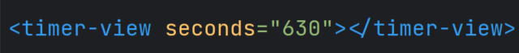
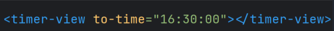
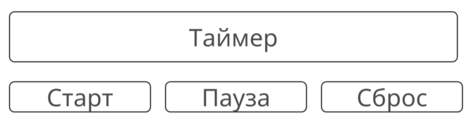

# Red Collar Frontend School 2023, Homework №5. Web-components, Shadow DOM.

Необходимо реализовать пользовательский элемент таймер обратного отсчета. Установка времени для обратного отсчёта принимается через один из атрибутов:
1. `seconds` - время в таком случае передается в виде количества секунд:

2. `to-time` - в таком случае мы передаем значение в виде времени в формате **ЧЧ:ММ:СС**. Элементу необходимо будет рассчитать, сколько осталось часов, минут и секунд до указанного времени. И принять это значения для обратного
отсчёта

К примеру, если передать в атрибут значение 16:30:00, а текущее время составляет 16:27:30, то таймеру будет отсчитывать время с 2 минут 30 секунд

(!) Обязательно необходимо следить за обновлением этих атрибутов. В таком случае таймер будет

- останавливаться, если запущен
- сбрасывать время отсчета до нового значения

По умолчанию таймер выключен и показывает оставшееся время до конца таймера. Время отображается в формате **ЧЧ:ММ:СС**. Если кол-во часов равно 0, то опустить отображение часов и показывать время в формате **ММ:СС**. Элемент с временем
должен располагаться в закрытом **Shadow DOM**.

Также необходимо подписать элемент таймера на пользовательские события **(CustomEvents)**:

1. `starttimer` - при возникновении этого события на элементе, таймер начинает обратный отсчёт
2. `pausetimer` - событие, после которого таймер приостановит свою работу
3. `resettimer` - событие, после которого таймер сбросит значение времени до начального и остановит работу

Внутри таймера также необходимо генерировать событие `endtimer`, когда время отсчета таймера заканчивается.

Помимо таймера необходимо реализовать рядом с ним три кнопки, каждая из которых будет генерировать одно из пользовательских событий для управления таймера и
вызывать их на нём.

Сложный здесь дизайн не требуется, достаточно придерживаться этой схемы построения блоков:

### Критерии приема
1. В документе создан и определен пользовательских элемент таймера
2. Время обратного отсчета настраивается через атрибуты seconds или to-time
3. Возможно обновление времени при изменении значения атрибутов seconds или to-time
4. Время до конца таймера отображается в закрытом Shadow DOM
5. Таймером можно управлять с помощью пользовательских событий
6. Таймер генерирует событие по завершении работы
